# Architecture Diagrams

## 1. Data Flow Activity Diagram (Frontend ↔ Backend)

This diagram shows how data flows between the Streamlit UI and the FastAPI backend.

```mermaid
flowchart TB
    subgraph UI["🖥️ Streamlit UI (ui/app.py)"]
        A[User Input<br/>Ticker/Parameters] --> B{Select Action}
        B --> C[📊 Get Markets]
        B --> D[🔍 Get Market Data]
        B --> E[🤖 Get AI Estimate]
        B --> F[📈 Get Price History]
        B --> G[🧮 Get Metrics]
    end

    subgraph HTTP["🌐 HTTP Requests"]
        C -->|GET /markets| H[HTTP Request]
        D -->|GET /market/ticker| H
        E -->|GET /estimate/ticker| H
        F -->|GET /history/ticker| H
        G -->|GET /metrics/ticker| H
    end

    subgraph API["⚡ FastAPI Backend (main.py)"]
        H --> I[Route Handler]
        I --> J{Endpoint}
        J -->|/markets| K[get_top_markets]
        J -->|/market| L[get_market_data]
        J -->|/estimate| M[estimate_probability]
        J -->|/history| N[get_price_history]
        J -->|/metrics| O[get_metrics_only]
    end

    subgraph Services["🔧 Backend Services (src/)"]
        K --> P[kalshi_client.get_markets]
        L --> Q[kalshi_client.get_market_with_orderbook]
        M --> R[llm_client.estimate_probability]
        M --> S[prediction_client.predict_from_history]
        M --> Q
        M --> T[kalshi_client.get_market_history]
        N --> Q
        N --> T
        O --> Q
        O --> U[calculations.calculate_decision_metrics]
    end

    subgraph External["☁️ External APIs"]
        P --> V[(Kalshi API)]
        Q --> V
        T --> V
        R --> W[(OpenAI API<br/>with Web Search)]
        S --> W
    end

    subgraph Response["📤 Response Flow"]
        V --> X[Market Data<br/>JSON Response]
        W --> Y[AI Analysis<br/>JSON Response]
        X --> Z[Pydantic Model<br/>Validation]
        Y --> Z
        Z --> AA[HTTP Response]
        AA --> AB[Streamlit Displays<br/>Charts/Tables/Metrics]
    end

    style UI fill:#e1f5fe,stroke:#01579b
    style API fill:#f3e5f5,stroke:#4a148c
    style Services fill:#fff3e0,stroke:#e65100
    style External fill:#ffebee,stroke:#b71c1c
    style Response fill:#e8f5e9,stroke:#1b5e20
```

---

## 2. Context Diagram (System Architecture)

This diagram shows all subsystems and how they interact with each other.

```mermaid
flowchart TB
    subgraph User["👤 User"]
        U[Web Browser]
    end

    subgraph Frontend["🖥️ Frontend Layer"]
        ST[Streamlit App<br/>ui/app.py<br/>─────────────<br/>• Market Browser<br/>• Market Analysis<br/>• AI Estimates<br/>• Price Charts<br/>• Decision Metrics]
    end

    subgraph Backend["⚡ Backend Layer (FastAPI)"]
        subgraph API["API Gateway - main.py"]
            EP1["GET /markets"]
            EP2["GET /market/{ticker}"]
            EP3["GET /estimate/{ticker}"]
            EP4["GET /history/{ticker}"]
            EP5["GET /metrics/{ticker}"]
            EP6["GET /analyze/{ticker}"]
        end

        subgraph Core["Core Services"]
            KC["🔑 KalshiClient<br/>kalshi_client.py<br/>─────────────<br/>• RSA Signing<br/>• Market Data<br/>• Orderbook<br/>• Price History"]

            LC["🧠 LLMClient<br/>llm_client.py<br/>─────────────<br/>• Web Search<br/>• Probability Est.<br/>• Structured Output"]

            PC["📈 PredictionClient<br/>llm_client.py<br/>─────────────<br/>• Historical Analysis<br/>• Next-Day Prediction<br/>• Trend Detection"]

            CC["🧮 Calculations<br/>calcuations.py<br/>─────────────<br/>• Spread Cost<br/>• Alpha/Edge<br/>• Expected Value<br/>• Kelly Criterion"]
        end

        subgraph Data["Data Layer"]
            MD["📋 Models<br/>models.py<br/>─────────────<br/>• MarketData<br/>• MarketSummary<br/>• DecisionMetrics<br/>• PriceHistory<br/>• CombinedEstimate"]

            CF["⚙️ Config<br/>config.py<br/>─────────────<br/>• API Keys<br/>• Base URLs<br/>• RSA Keys"]
        end
    end

    subgraph External["☁️ External Services"]
        KA["🏛️ Kalshi API<br/>api.elections.kalshi.com<br/>─────────────<br/>• Prediction Markets<br/>• Real-time Prices<br/>• Historical Data"]

        OA["🤖 OpenAI API<br/>─────────────<br/>• GPT-4o-mini-search<br/>• Web Search Context<br/>• Structured Outputs"]
    end

    U <-->|HTTP :8501| ST
    ST <-->|HTTP :8000<br/>REST API| API

    EP1 --> KC
    EP2 --> KC
    EP3 --> KC
    EP3 --> LC
    EP3 --> PC
    EP4 --> KC
    EP5 --> KC
    EP5 --> CC
    EP6 --> KC
    EP6 --> CC

    KC <-->|HTTPS<br/>RSA Signed| KA
    LC <-->|HTTPS<br/>API Key Auth| OA
    PC <-->|HTTPS<br/>API Key Auth| OA

    KC --> MD
    LC --> MD
    PC --> MD
    CC --> MD
    CF --> KC
    CF --> LC
    CF --> PC

    style User fill:#e3f2fd,stroke:#1565c0
    style Frontend fill:#e1f5fe,stroke:#01579b
    style Backend fill:#f3e5f5,stroke:#4a148c
    style External fill:#ffebee,stroke:#b71c1c
```

---

## 3. Sequence Diagram (AI Estimate Flow)

This diagram shows the detailed sequence for the most complex operation: getting an AI probability estimate.

---

## Component Summary

| Layer | Component | File | Responsibility |
|-------|-----------|------|----------------|
| **Frontend** | Streamlit App | `ui/app.py` | User interface, data visualization, HTTP client |
| **API** | FastAPI | `main.py` | REST endpoints, request handling, response formatting |
| **Service** | KalshiClient | `src/kalshi_client.py` | Kalshi API auth (RSA), market data fetching |
| **Service** | LLMClient | `src/llm_client.py` | OpenAI web search, probability estimation |
| **Service** | PredictionClient | `src/llm_client.py` | Historical analysis, price prediction |
| **Service** | Calculations | `src/calcuations.py` | Trading metrics (spread, alpha, EV, Kelly) |
| **Data** | Models | `src/models.py` | Pydantic schemas for validation |
| **Config** | Settings | `config.py` | Environment variables, API keys |
| **External** | Kalshi API | - | Prediction market data |
| **External** | OpenAI API | - | AI analysis with web search |
